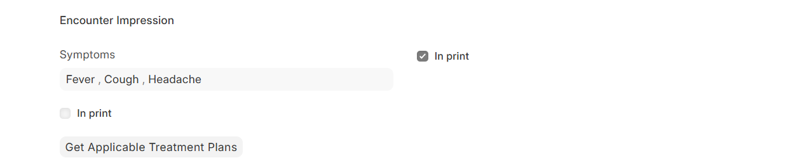
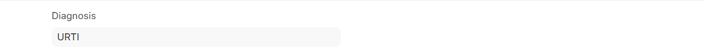
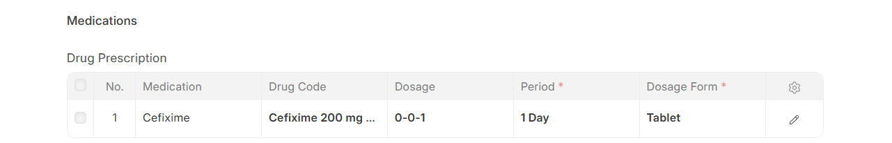
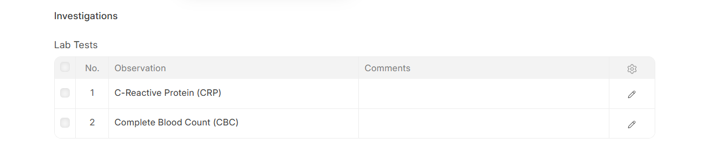
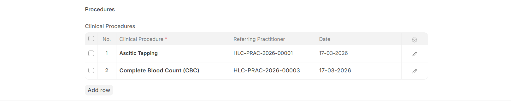
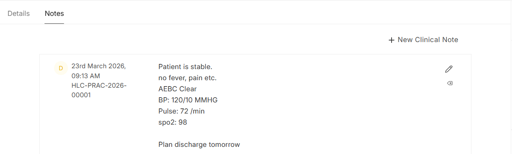
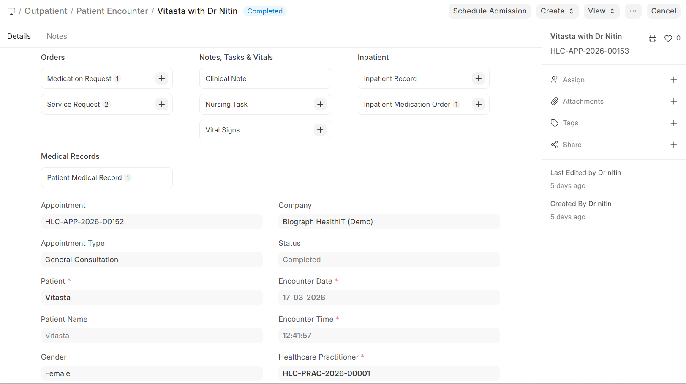

# Patient Encounter (Consultation)

## User Story

> As a **physician**, I want to document a clinical consultation so that diagnoses, prescriptions, and orders are properly recorded and actionable.

## Entry Point

- From appointment: Patient Appointment > Create > Patient Encounter (`make_encounter`)
- Direct: Desk > Patient Encounter > New

## Steps

1. **Record symptoms/complaints**
   - Screen: Patient Encounter form > Symptoms section
   - User action: Add complaints from master list
   - Data changed: Patient Encounter Symptom child records
  
     

2. **Record diagnoses**
   - User action: Add diagnoses (linked to medical codes)
   - Data changed: Patient Encounter Diagnosis child records
  
     

3. **Prescribe medications**
   - User action: Add drugs with dosage, duration, frequency
   - API: `get_medications_query()` for autocomplete, `get_medications(medication)` for details
   - Data changed: Drug Prescription child records
  
     

4. **Order lab tests**
   - User action: Add lab test items
   - Data changed: Lab Prescription child records
  
     

5. **Order procedures**
   - User action: Add clinical procedure items
   - Data changed: Procedure Prescription child records
  
     

6. **Apply treatment plan** *(optional)*
   - User action: Click "Get Treatment Plan"
   - API: `get_applicable_treatment_plans(encounter)` → `set_treatment_plans(treatment_plans)`
   - Data changed: Auto-populates prescriptions from template

7. **Add clinical notes** *(optional)*
   - User action: Write SOAP-style notes
   - API: `add_clinical_note(note, note_type)`, `edit_clinical_note()`, `delete_clinical_note()`
  
     

8. **Submit encounter**
   - User action: Submit
   - Automatic: Creates Service Requests and Medication Requests
   - API: `create_service_request(encounter)`, `create_medication_request(encounter)`
   - Data changed: Service Request + Medication Request records created
   - Doc event: `on_submit` → Patient Medical Record created

9. **Create sidebar orders** *(alternative)*
   - User action: Use encounter sidebar widget to order individually
   - API: `create_service_request_from_widget(encounter, data)`
  
     

## Error States

- Encounter without patient → validation error
- Duplicate service requests → prevented by status checks

## Permissions

- **Physician**: Full encounter access
- **Healthcare Administrator**: Can view and manage

## Related Code

- Backend: `healthcare/healthcare/doctype/patient_encounter/patient_encounter.py` (16 whitelisted methods)
- Models: Patient Encounter, Drug Prescription, Lab Prescription, Procedure Prescription, Service Request, Medication Request
